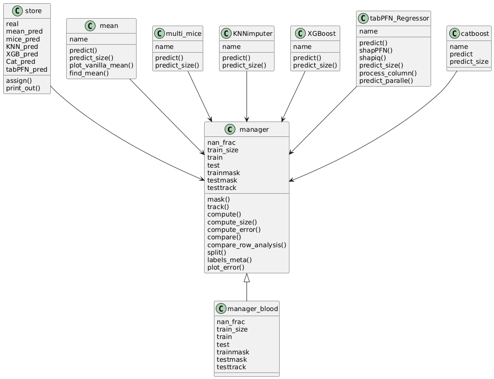
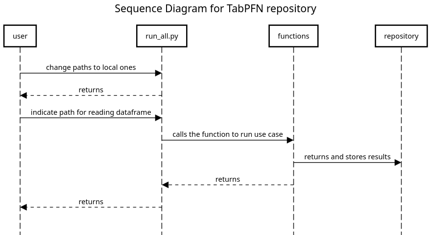

## Table of Contents

1. [Overview](#overview)
2. [Usage](#usage)

---

## Overview
This repository tries to evaluate the tabPFN imputation techniques. It will be compared with other imputation methods like XGBoost, Catboost, MICE and so on. The goal is to show which of these methods performs better, depending on different conditions, like the nan percantage, or the train size. 
All the code has been written in python.
To see all the work done, please refer to notion page of repository: ```https://www.notion.so/schneiderlab/Data-Imputation-Benchmark-1afa4699a977808486a1ecdc880a0fb6```

NOTE: Repository is in development.
---

 
## Usage
**Prerequisites**:
The code runs on the RWTH Cluster on the node login23-g-1.hpc.itc.rwth-aachen.de. This node has a 4 Invidia H100 Gpu that are used to run both TabPFN and Catboost. Thus, to run the scripts you need to have access to the RWTH Cluster and install the cuda package in python. Other packages like scikitlearn, tabPFN, pandas, numpy, catboost, xgboost, math are needed as well.

**Structure**
In the python script in src/MICE.py you find the main code used to assess the different imputation methods. This includes classes for mean imputation, mice imputation, KNN imputation, XGBoost, Catboost, random forest and tabPFN. 
In all the classes there are different functions to evaluate different use cases. 
There are in total 4 different use cases: 
1. Measurament of runtime and error;
2. Evaluation of error when reducing train data
3. Evaluation of the error per feature
4. Shap matrices

To run the first use case the class ```manager_blood``` is directly instantiated in the function ```src/functions/sim_error_time.py```. The function used for the comparison is the standard ```manager_blood.compare()```. 

To run the second use case, the class ```manager_blood``` is  instantiated in the function ```src/functions/run_train_frac_error.py```. The function used for the comparison is the standard ```manager_blood.compare_row_analysis(train_frac[i])```.

The third use case is run in ```src/functions/run_error_column.py```. To run it the class in ```src/visualization/visualize_distribution.py``` is instantiated.

For the fourth use case we created the class ```manager_feature_matrix``` in ```src/visualization/create_feature_matrix.py``` and then we run it ```src/functions/run_feature_matrix.py```. 

As a remark, we actually didn't run every time the sinle functions but we run everythig from ```src/run_all.py``. 

To run the second use case, 
Under src/tabpfn-extensions you find the new extensions created by the developer of tabPFN and by the whole community. Very important for us are the shap functionalities. Source of repository: ```https://github.com/PriorLabs/TabPFN```

**UML Class diagram**

Used program: Plantuml

**UML Sequence diagram**

Used program: sequencediagram.org


