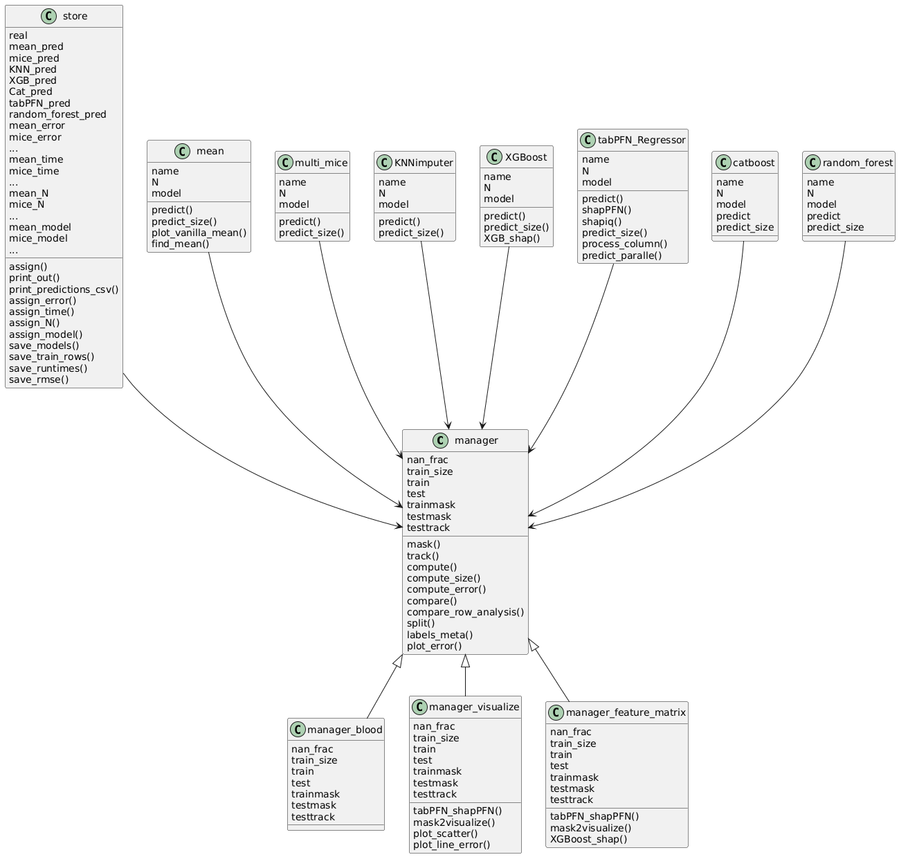

## Table of Contents

1. [Overview](#overview)
2. [Usage](#usage)

---

## Overview
This repository tries to evaluate the tabPFN imputation techniques. It will be compared with other imputation methods like XGBoost, Catboost, MICE and so on. The goal is to show which of these methods performs better, depending on different conditions, like the nan percantage, or the train size. 
All the code has been written in python.
Notion page of repository: ```https://www.notion.so/schneiderlab/Data-Imputation-Benchmark-1afa4699a977808486a1ecdc880a0fb6```

NOTE: Repository is in development.
---

 
## Usage
**Prerequisites**:
Python, pip, scikitlearn, tabPFN, pandas, numpy, catboost, xgboost, math

**Structure**
In the python script imputation.py you find the main code used to assess the different imputation methods. 
Under tabpfn-extensions you find the new extensions created by the developer of tabPFN and by the whole community. Very important for us are the shap functionalities. Source of repository: ```https://github.com/PriorLabs/TabPFN```

**UML Class diagram**

Used program: Plantuml


